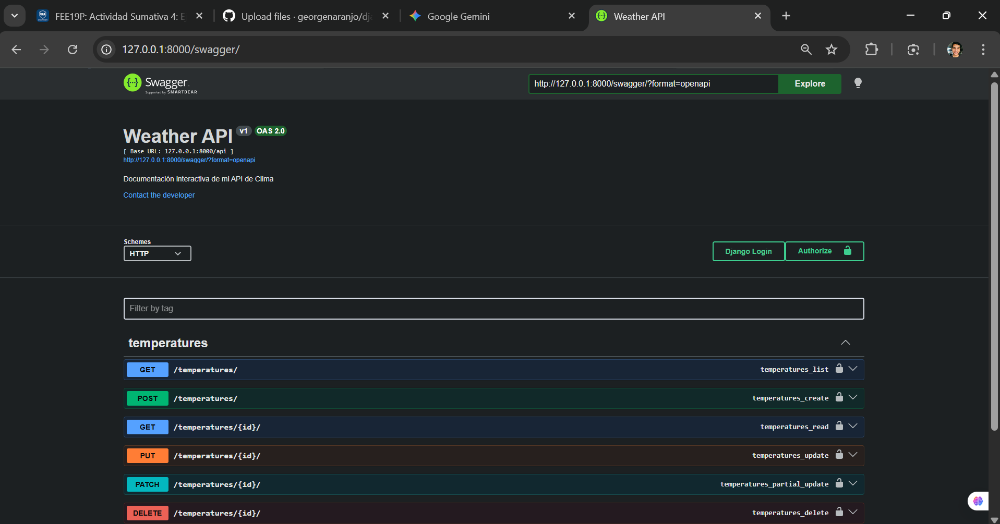
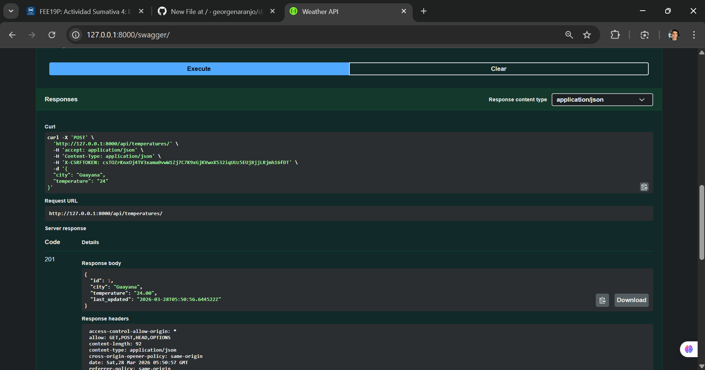

# Weather API 

Proyecto de API para gestionar temperaturas de ciudades.

## Funcionamiento:

### 1. Interfaz de Swagger
Esta es la pantalla principal donde se ven todos los servicios de la API:

### 2. Consulta de Datos (GET)
Aquí se muestra que la base de datos está funcionando y devuelve la información:

## Para ejecutar el proyecto:
1. Activar entorno virtual: `.\venv\Scripts\activate`
2. Iniciar servidor: `python manage.py runserver`
3. Ver API: Entrar a `http://127.0.0.1:8000/swagger/`
